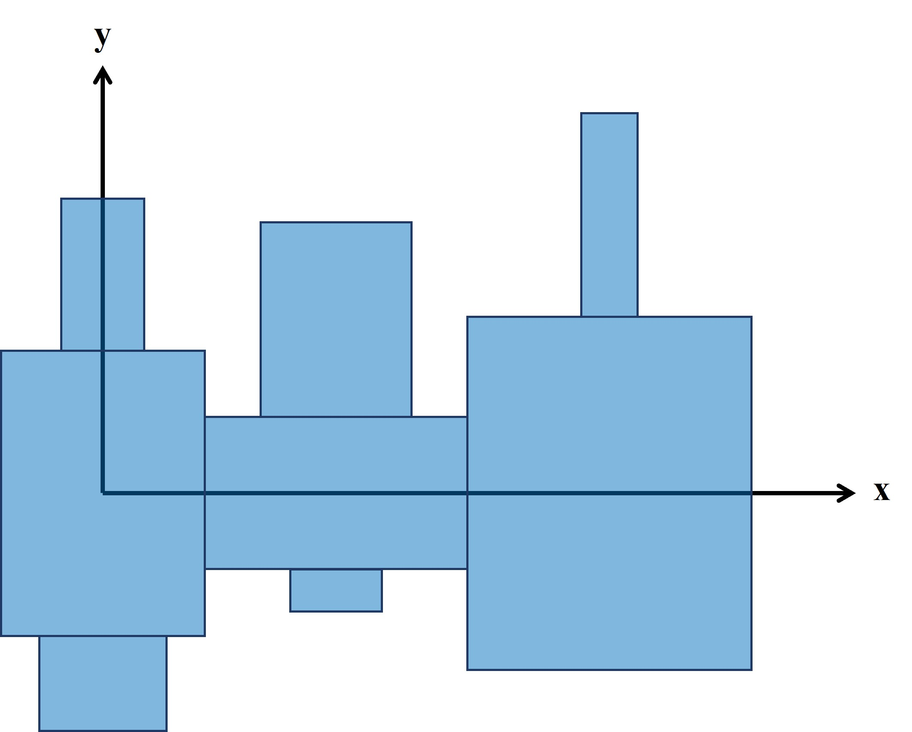
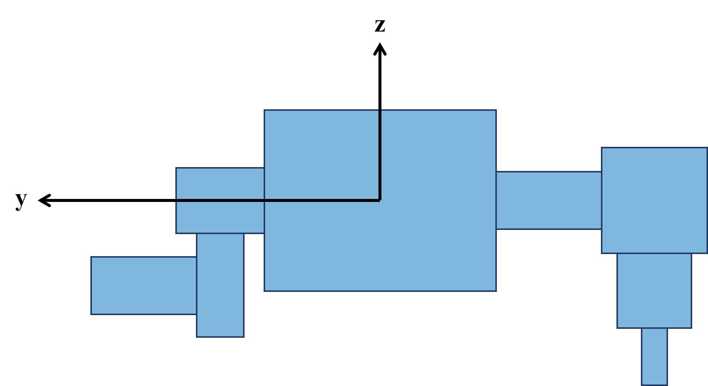

# **ME495-Assignment7**
 
## **Information**
#### 
- The goal of this assignment is to grow a creature with randomized links.
- Leg links are grown from a "torso" link on each side face.  Each leg can have 0 to 4 links, growing either downward or outward to the side.  Between 1 and 5 "torsos" are created.
- Joints are centered on the face of attachment.  Each joint has a randomized axis of rotation.  Each joint is motorized.
- A random number of links between 3 and the total number of links are sensorized.  These links are represented with green.  Links without sensors are blue.
- This figure shows how links and joints are grown to create a given creature:




- The left figure shows how torso vertebrae are grown and include an outward leg on 0 to 2 side faces.  Starting at the origin, a random number of vertebrae are grown in the +x direction.
- The right figure shows how leg links are grown outward (+/-y direction) and downward (-z direction).  Quantity, growth direction, and axis of rotation are chosen randomly for each link.

[Video example including several creatures](www.google.com) 


 

## **How to run**
#### 
1) Clone this repository
2) Install [pybullet](https://pybullet.org/wordpress/).  More information on getting started avaiable at the [Ludobots MOOC Installation](https://www.reddit.com/r/ludobots/wiki/installation/) page 
3) Navigate to this repository in command prompt
4) Run ```py mainTemp.py```


## **Sources**
#### 
- This project is a part of ME495 Artificial Life at Northwestern University.
- This course uses the [Ludobots MOOC](https://www.reddit.com/r/ludobots/) for coding projects